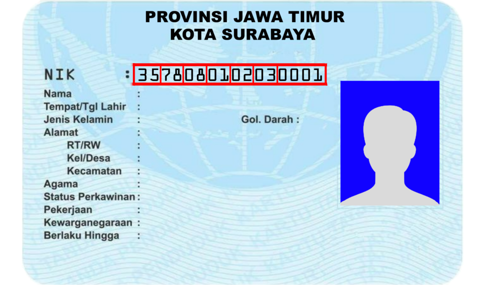
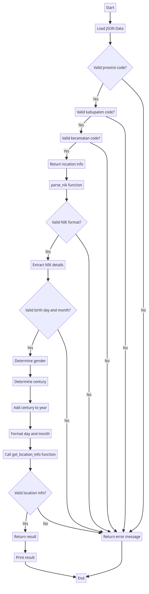

# INFO
Saya telah memperbarui Kode Wilayah menjadi 38 Provinsi dan juga menambahkan Kelurahan/Desa. Jika Anda memiliki masalah atau pertanyaan, silakan kirim pesan melalui email ke saya.

Email: axroc98@proton.me

# Apa itu NIK?
NIK merupakan singkatan dari Nomor Induk Kependudukan. NIK adalah sebuah identifikasi numerik yang diberikan kepada setiap penduduk yang terdaftar dalam administrasi kependudukan di Indonesia. Setiap individu yang terdaftar sebagai penduduk di Indonesia memiliki NIK yang unik.

NIK terdiri dari serangkaian angka yang memiliki format standar. Panjang NIK adalah 16 digit, dan setiap digit memiliki makna dan peran tertentu dalam mengidentifikasi informasi tentang individu tersebut.

NIK memiliki peran penting dalam mengidentifikasi identitas dan data pribadi seseorang di Indonesia. NIK digunakan dalam berbagai aspek administratif, termasuk pendataan, pelayanan publik, identifikasi individu, dan keperluan lainnya.

# Format NIK


```
Contoh NIK: 3578080102030001
[35]-[78]-[08]-[01]-[02]-[03]-[0001]
│    │    │    │   │    │    │
│    │    │    │   │    │    └──> No Urut, Di Kecamatan yang memiliki Tanggal Lahir sama.
│    │    │    │   │    │ 
│    │    │    │   │    └──> Tahun Lahir
│    │    │    │   │
│    │    │    │   └──> Bulan Lahir
│    │    │    │
│    │    │    └──> Tanggal Lahir. Jika Tanggalnya di atas 40 itu wanita dan di bawa 31 itu pria.
│    │    │
│    │    └──> Kode Kecamatan
│    │
│    └──> Kode Kabupaten
│
└──> Kode Provinsi
```

# Data Provinsi
| No   | Code Provinsi | Nama Provinsi               |
|:----:|:-------------:|:---------------------------:|
| 1    | 11            | ACEH                        |
| 2    | 12            | SUMATERA UTARA              |
| 3    | 13            | SUMATERA BARAT              |
| 4    | 14            | RIAU                        |
| 5    | 15            | JAMBI                       |
| 6    | 16            | SUMATERA SELATAN            |
| 7    | 17            | BENGKULU                    |
| 8    | 18            | LAMPUNG                     |
| 9    | 19            | KEPULAUAN BANGKA BELITUNG   |
| 10   | 21            | KEPULAUAN RIAU              |
| 11   | 31            | DKI JAKARTA                 |
| 12   | 32            | JAWA BARAT                  |
| 13   | 33            | JAWA TENGAH                 |
| 14   | 34            | DAERAH ISTIMEWA YOGYAKARTA  |
| 15   | 35            | JAWA TIMUR                  |
| 16   | 36            | BANTEN                      |
| 17   | 51            | BALI                        |
| 18   | 52            | NUSA TENGGARA BARAT         |
| 19   | 53            | NUSA TENGGARA TIMUR         |
| 20   | 61            | KALIMANTAN BARAT            |
| 21   | 92            | PAPUA BARAT                 |
| 22   | 62            | KALIMANTAN TENGAH           |
| 23   | 63            | KALIMANTAN SELATAN          |
| 24   | 64            | KALIMANTAN TIMUR            |
| 25   | 65            | KALIMANTAN UTARA            |
| 26   | 71            | SULAWESI UTARA              |
| 27   | 72            | SULAWESI TENGAH             |
| 28   | 73            | SULAWESI SELATAN            |
| 29   | 74            | SULAWESI TENGGARA           |
| 30   | 75            | GORONTALO                   |
| 31   | 76            | SULAWESI BARAT              |
| 32   | 81            | MALUKU                      |
| 33   | 82            | MALUKU UTARA                |
| 34   | 91            | PAPUA                       |
| 35   | 93            | PAPUA SELATAN               |
| 36   | 94            | PAPUA TENGAH                |
| 37   | 95            | PAPUA PEGUNUNGAN            |
| 38   | 96            | PAPUA BARAT DAYA            |
|:----:|:-------------:|:---------------------------:|

# Contoh Output
```
Provinsi: JAWA TIMUR
Kabupaten: KOTA SURABAYA
Kecamatan: Gubeng
Tanggal Lahir: 01-02-2003
Jenis Kelamin: Laki-laki
No Urut: 0001
```

# FlowChart

